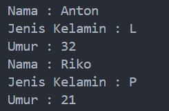

# Enkapsulasi / Encapsulation


Enkapsulasi adalah prinsip di dalam pemrograman dengan teknik OOP atau Object- Oriented Programming yang umum diterapkan di sejumlah model maupun bahasa pemrograman, seperti proses hosting website, REST API sampai bahasa pemrograman Java.

Manfaat utama enkapsulasi umumnya untuk meningkatkan keamanan data di suatu dokumen kode. <br> <br>

## Latihan

Buatlah kode program java untuk : <br>
• Mendeklarasikan class Person, dengan atribut Nama, JenisKelamin, Umur dan lengkapi dengan access modifier. <br>
• Buatlah dua buah objek dari class Person bernama Anton dan Riko dan panggil method setter dan getter.<br> <br>

## File <b>Person.java</b>
``` java
public class Person {
    private String nama;
    private char jenisKelamin;
    private int umur;

    // Constructor
    public Person(String nama, char jenisKelamin, int umur) {
        this.nama = nama;
        this.jenisKelamin = jenisKelamin;
        this.umur = umur;
    }

    // Getters and Setters
    public String getNama() {
        return nama;
    }

    public void setNama(String nama) {
        this.nama = nama;
    }

    public char getJenisKelamin() {
        return jenisKelamin;
    }

    public void setJenisKelamin(char jenisKelamin) {
        this.jenisKelamin = jenisKelamin;
    }

    public int getUmur() {
        return umur;
    }

    public void setUmur(int umur) {
        this.umur = umur;
    }
}
```
<br>

## File <b>Main.java</b>
```java
public class Main {
    public static void main(String[] args) {

        Person person = new Person("Anton", 'L', 32);

        System.out.println("Nama : " + person.getNama());
        System.out.println("Jenis Kelamin : " + person.getJenisKelamin());
        System.out.println("Umur : " + person.getUmur());

        person.setNama("Riko");
        person.setJenisKelamin('P');
        person.setUmur(21);

        System.out.println("Nama : " + person.getNama());
        System.out.println("Jenis Kelamin : " + person.getJenisKelamin());
        System.out.println("Umur : " + person.getUmur());
    }
}
```
<br>

Untuk mengcompile dan menjalankan program, kita dapat menggunakan perintah berikut :
``` java
javac Person.java Main.java
java Main
```

Perintah ```javac``` berfungsi untuk mengompilasi file sumber bahasa pemrograman Java menjadi file kelas yang dapat berjalan di <b>Java Virtual Machine (JVM)</b>.<br> <br>

Dan menghasilkan output seperti berikut : <br> <br>
 <br>

#### Penjelasannya :
1. Kita membuat dua file Java, yaitu <b>Person.java</b> dan <b>Main.java</b>.

2. Pada file <b>Person.java</b>, kita membuat class ```Person``` dengan tiga atribut private, yaitu ```nama```, ```jenisKelamin```, dan ```umur```.

3. Kita juga membuat konstruktor ```Person``` yang memungkinkan kita membuat objek ```Person``` dengan atribut yang telah diinisialisasi.

4. Kita membuat getter dan setter untuk setiap atribut, sehingga kita dapat mengakses dan mengubah atribut tersebut.

5. Pada file <b>Main.java</b>, kita membuat objek ```Person``` baru dan mengakses atributnya menggunakan ```getter```.

6. Kita juga mengubah atribut menggunakan ```setter``` dan mencetak atribut yang telah diubah. <br> <br>

 
